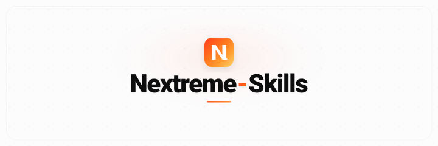

<p align="center">
  
</p>

# Nextreme Skills

<p align="center">
  <a href="https://skills.sh/beast-ofcourse/Nextreme-skills"></a>
</p>

A focused, **agent-agnostic** collection of reusable AI-agent skills. Each skill lives in its own directory as a single `SKILL.md` (plus `references/` when the body needs to stay lean). They carry no tool ACLs and no agent-specific subagent ids — state behavior, not permissions — so any agent can run them.

## Skills

| Skill | What it does | Invoke when |
| --- | --- | --- |
| [`next-best-thing`](next-best-thing/) | Finds the **single smallest** change with the highest impact and ships it. | "next best thing", "smallest high-leverage step", "what should I do next" |
| [`next-best-improvement`](next-best-improvement/) | Picks **one feature-flow-level fragment** that noticeably needs extreme improvement (scan whole project, then `user` / `yolo` / `random` pick) and makes it **insane** — can do anything inside the part, branch-gated + proof-backed. | "next best improvement", "improve a part", "make this insane", "yolo improve", "random improvement" |
| [`next-big-thing`](next-big-thing/) | Finds the **highest-impact big/medium** build: ships low-risk small stuff autonomously, then gates a feature shortlist on your approval. | "next big thing", "plan a major feature", "biggest move" |
| [`nextreme-decision`](nextreme-decision/) | Makes the **most extreme, highest-leverage** call on anything — commits to ONE recommendation, then offers an out-of-the-box alternative. | "decide for me", "make the extreme call", "settle this" |
| [`nextreme-architect`](nextreme-architect/) | Spec-driven system architect: interviews (or takes a `yolo` mandate), then writes the buildable blueprint — no implementation. | "architect this", "plan the system", "write the spec" |
| [`nextreme`](nextreme/) | Pair programmer that **composes** the right Nextreme-skill workflow for any multi-phase software task. | "pair with me", "full workflow for X", "build this with me" |
| [`nextreme-router`](nextreme-router/) | Routes any user intent to the **right** Nextreme skill instead of guessing which one fires. | "which skill should I use", "route this" |
| [`nextreme-skill-creator`](nextreme-skill-creator/) | Designs, writes, and improves skills with rigorous craft (predictability, triggering, hierarchy, pruning). | "create a skill", "improve this skill", "why doesn't my skill trigger" |
| [`nextreme-tdd`](nextreme-tdd/) | Extreme red-green-refactor TDD: pins one behavior, enforces RED-before-GREEN, scaffolds failing tests and verifies the cycle (pytest/Vitest/Go/Cargo). | "TDD this", "red-green-refactor", "write test before code", "failing test first", "characterization test" |
| [`tdd-coach`](tdd-coach/) *(deprecated → [`nextreme-tdd`](nextreme-tdd/))* | Deprecated alias for `nextreme-tdd` — forwards to the extreme engine. Use `nextreme-tdd` for new work. | "TDD this" *(redirects to nextreme-tdd)* |
| [`git-guardrails`](git-guardrails/) | Stops destructive, irreversible git operations before they run and suggests the safe path. | "guard my git", "block force push", "don't let me reset --hard" |
| [`nextreme-flowcharts`](nextreme-flowcharts/) | Produces publication-grade flowcharts, roadmaps, process diagrams, decision trees, and taxonomy maps as print-ready PDF (HTML+SVG). | "flowchart", "roadmap", "decision tree", "process diagram" |
| [`nextreme-charts`](nextreme-charts/) | Generates publication-grade SVG charts from data (Vega-Lite/Vega, QuickChart, ECharts) for every chart type. | "chart", "bar chart", "line chart", "visualize this data" |
| [`nextreme-diagrams`](nextreme-diagrams/) | Generates system architecture, UML, AI/agent workflows, C4, and event-driven technical diagrams (SVG/PDF). | "system diagram", "architecture diagram", "UML", "sequence diagram" |
| [`nextreme-docs`](nextreme-docs/) | Generates publication-grade `.docx` / `.doc` Word documents — reports, proposals, resumes, invoices, letters, contracts, manuals, papers, certificates — with disciplined styles, explicit geometry, field-backed TOC/page numbers, and OOXML validation. | "Word document", "docx", "doc", "report", "resume", "invoice", "proposal", "contract", "letter" |
| [`nextreme-pptx`](nextreme-pptx/) | Generates insane, unbound PowerPoint `.pptx` decks — pitch, report, academic, editorial, Bento — with native editable shapes, chart+table, geometry-validated Bento Grid, and zero overlap/overflow. | "pptx", "ppt", "PowerPoint", "slides", "deck", "pitch deck", "presentation" |
| [`nextreme-pdf`](nextreme-pdf/) | Generates taste-driven, unbound PDF documents — reports, proposals, resumes, portfolios, magazines — with zinc/parchment taste, editorial typography, HTML+Tailwind → Playwright/Paged.js, and page-as-canvas QC. | "pdf", "PDF", "report", "proposal", "resume", "portfolio", "magazine", "whitepaper" |
| [`nextreme-svg`](nextreme-svg/) | Creates, optimizes, animates, and restyles publication-grade SVG — icons, logos, illustrations, diagrams, charts, patterns, text art — spec-correct, five-zone lighting, layered, 4-format output. | "svg", "SVG", "icon", "logo", "illustration", "diagram", "chart", "pattern", "filter" |
| [`readme-architect`](readme-architect/) | Writes a repo-grounded, professional `README.md` after investigating the actual codebase. | "write a README", "make my repo look professional", "add docs" |

## How the "next thing" skills differ

- **`next-best-thing`** thinks *small*: one shippable move, no approval gate, opt-in loop for repeated small wins.
- **`next-best-improvement`** thinks *extreme*: picks one feature-flow-level fragment that noticeably needs it (whole-project scan + `user` / `yolo` / `random` pick), **must** create a new branch first, then extremely improves it with out-of-the-box brainstorming — proves with before/after + benchmarks.
- **`next-big-thing`** thinks *large*: clears the safe wins itself, then **stops and waits** for you to pick the big build before writing it.

## Install

Skills are installed per-agent from this repo (skills.sh indexes it via the `agent-skills` topic):

```bash
# one skill
npx skills add beast-ofcourse/Nextreme-skills --skill nextreme-decision

# everything
npx skills add beast-ofcourse/Nextreme-skills --all
```

Or copy a skill folder into your agent's skills directory. Each `SKILL.md` is self-contained.

## Layout

```
.
├── README.md                       # this index
├── banner.svg                      # repo banner
├── AGENTS.md                       # Engineering Operating System (EOS) + skill catalog
├── next-best-thing/                # smallest-high-impact skill
├── next-best-improvement/          # extreme fragment improvement (user/yolo/random pick, branch-gated)
├── next-big-thing/                 # biggest-high-impact skill (gated)
├── nextreme-decision/              # extreme decision-maker
├── nextreme-architect/             # spec-driven planning (portable)
├── nextreme/                       # pair-programmer workflow composer
├── nextreme-router/                # intent -> skill router
├── nextreme-skill-creator/         # skill authoring craft + workflow
│   └── references/                 # glossary.md, workflow.md
├── nextreme-docs/                  # extreme .docx/.doc Word documents (9 templates, OOXML validation)
│   ├── references/                 # document-engine.md, style-system.md, document-types.md, validation-checklist.md
│   ├── scripts/                    # create_docx.py, validate_docx.py
│   └── templates/                  # report, proposal, resume, invoice, letter, contract, manual, certificate, academic
├── nextreme-pptx/                  # insane unbound .pptx decks — 5 templates, dual engine (python-pptx + PptxGenJS), Bento Grid, geometry gates
│   ├── references/                 # engine-matrix.md, style-system.md, slide-types.md, validation.md
│   ├── scripts/                    # create_pptx.py, validate_pptx.py, render_pptx.mjs
│   └── templates/                  # pitch, report, academic, editorial, bento
├── nextreme-pdf/                   # taste-driven unbound PDF — 7 HTML templates, HTML+Tailwind+Playwright/Paged.js, page-as-canvas QC
│   ├── references/                 # design-taste.md, engine-matrix.md, document-types.md, validation.md
│   ├── scripts/                    # generate_pdf.py, render_pdf.mjs, validate_pdf.py
│   └── templates/                  # report, proposal, resume, portfolio, magazine, letter, minimal
├── nextreme-svg/                   # extreme vector — 9 SVG starters, spec-correct, five-zone lighting, layered, 4-format
│   ├── references/                 # svg-spec.md, illustration-taste.md, diagram-patterns.md, validation.md
│   ├── scripts/                    # validate_svg.py, render_svg.py
│   └── templates/                  # icon, logo, illustration, diagram, chart, pattern, animation, text, filter
├── nextreme-tdd/                   # extreme red-green-refactor TDD — behavior-pinned, order-enforced, 3 scripts + 4 templates + 3 refs + harness
│   ├── references/                 # test-patterns.md, framework-matrix.md, validation.md
│   ├── scripts/                    # detect_framework.py, scaffold_test.py, verify_tdd.py
│   └── templates/                  # python-pytest, typescript-vitest, go, rust
├── tdd-coach/                      # deprecated alias → nextreme-tdd (compatibility shim)
├── git-guardrails/                 # git safety rails
├── evals/                          # trigger-test prompts per skill
│   ├── next-best-thing.json
│   ├── next-big-thing.json
│   └── nextreme-skill-creator.json
└── templates/                      # shared SKILL.md scaffolding (SKILL.md.template)
    └── SKILL.md
```

## Authoring a new skill

Copy `templates/SKILL.md.template`, fill the frontmatter, and follow the craft in `nextreme-skill-creator`. Add matching prompts to `evals/`.

## License

MIT. Each skill is MIT-licensed (see its `SKILL.md` frontmatter).
