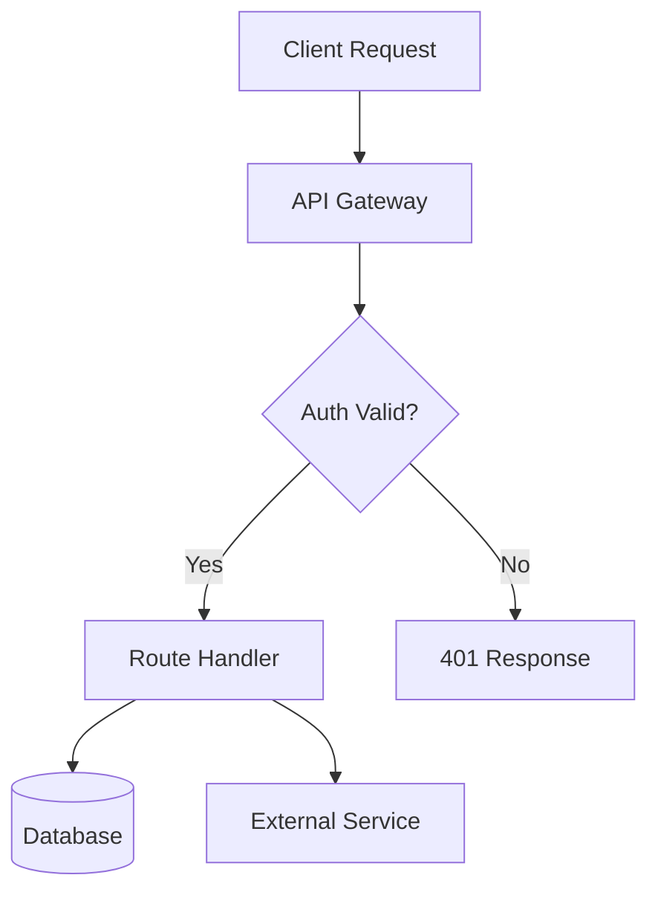
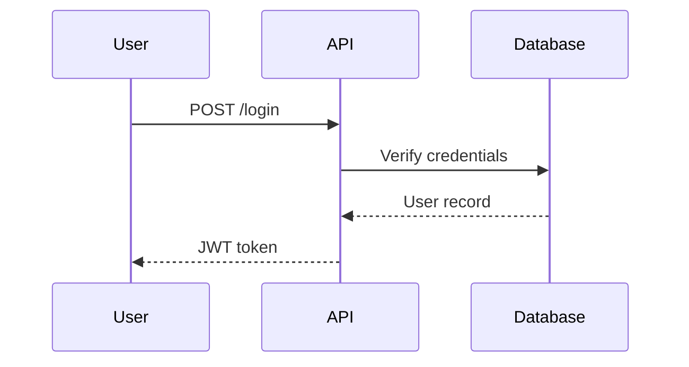

# README Architect

## Core Philosophy

A README is not a form to fill in. It is a **landing page with one job**: get a stranger from "what is this?" to "I get it, and here's my next action" in under 60 seconds — then serve as the reference doc for everyone who stays longer.

Three non-negotiable principles govern everything in this skill:

1. **Investigate before writing.** Never write a single line of README content from assumption, from the project name alone, or from a half-read file. A README that describes the repo wrong is worse than no README. Section 1 is mandatory and comes first, always.
2. **Ground style in real repos, not vibes.** "Professional README" is not a feeling — it's a set of concrete, observable patterns used by repos with tens of thousands of stars. Section 2 tells you what those patterns actually are, sourced from real, current conventions, not generic AI-README energy (no "🚀 Blazing fast!", no filler paragraphs, no emoji-per-bullet-point unless the project's own voice already uses that style).
3. **Match ambition to project reality.** A weekend CLI script and a 200-file distributed system do not get the same README. Over-scaffolding a small script (contributor guides, roadmaps, architecture diagrams for 80 lines of code) is exactly as wrong as under-scaffolding a serious library. Section 3 has you classify the project before choosing sections.

Do not start generating markdown until Sections 1 and 3 are done. This is the difference between an agent that produces a generic template and one that produces a README that actually reflects the repo.

---

## Section 1 — Investigate the Repository (mandatory, do this first)

You cannot write an honest README without reading the actual code. Treat this like onboarding as a new contributor. Budget real effort here — this is most of the value of this skill, not a preamble to skip.

### 1.1 Map the structure

```bash
# Get the shape of the repo before reading anything in detail
find . -maxdepth 3 -not -path '*/node_modules/*' -not -path '*/.git/*' -not -path '*/dist/*' -not -path '*/venv/*' -not -path '*/__pycache__/*' | sort
```

Use `view` on the top-level directory too. You're looking for:

- **Entry points** — `main.py`, `index.js`, `src/`, `cmd/`, `app/`
- **Manifest/config files** — `package.json`, `pyproject.toml`, `Cargo.toml`, `go.mod`, `composer.json`, `Gemfile`, `pom.xml`, `requirements.txt`. These tell you the real name, description, dependencies, scripts, and often the license.
- **Existing docs** — any current `README`, `docs/`, `CONTRIBUTING.md`, `ARCHITECTURE.md`, `CHANGELOG.md`, `.github/` (issue templates, workflows, `FUNDING.yml`)
- **CI/CD config** — `.github/workflows/*.yml`, `.gitlab-ci.yml`, `Jenkinsfile` — proves what's tested/deployed and how, and is a source of real (not invented) badges
- **License file** — `LICENSE`, `LICENSE.md`, `COPYING`
- **Existing visual assets** — `assets/`, `images/`, `docs/img/`, `.github/assets/` — check if a logo, banner, or screenshots already exist before offering to create one

### 1.2 Read the manifest for ground truth

Whichever manifest exists, actually open it — it usually has the truest one-line description, the real dependency list, the actual scripts/commands, and the license:

```bash
cat package.json 2>/dev/null
cat pyproject.toml 2>/dev/null
cat Cargo.toml 2>/dev/null
cat go.mod 2>/dev/null
```

Extract: package name, version, description field, `scripts`/entry-point commands, dependencies vs devDependencies (signals what's core vs tooling), license identifier, repository URL, author.

### 1.3 Understand what the code actually does

Don't just skim filenames — open the real entry point(s) and the most important 3–6 files. You're trying to answer, in your own words:

- What problem does this solve, for whom?
- What's the primary interface? (CLI? HTTP API? importable library? web app? background service?)
- What are the 3–5 features that actually matter, versus incidental utility code?
- What does a first successful run look like — literally, what command, what output?
- What does it depend on externally (a database, an API key, a specific runtime version, a GPU)?
- Is there an existing test suite? (`test/`, `tests/`, `*.spec.*`, `*_test.*`) — proves how to verify it works, and whether to include a "running tests" section.

If the repo is large, don't try to read every file. Prioritize: entry point → core module(s) it immediately imports → config/settings → one representative test. That's usually enough to describe the project honestly.

### 1.4 Detect the real tech stack (for badges later)

Cross-reference what you actually found — don't guess:

- Language(s): from manifest + file extensions (`find . -name "*.py" | head`, etc.)
- Framework(s): from dependency list (`react`, `fastapi`, `express`, `django`, `next`, `axum`...)
- Package registry presence: is this published to npm/PyPI/crates.io/RubyGems? (Check manifest `name` + registry, or ask/search if uncertain — never fabricate a package existing.)
- CI provider: from `.github/workflows/`
- License: from LICENSE file or manifest `license` field

### 1.5 Check for architecture worth diagramming

Skim for signs of non-trivial structure that a diagram would clarify: multiple services, a request/response pipeline, a plugin system, client+server split, a data pipeline with distinct stages, a state machine. If the whole repo is a single-purpose script or a small flat library, there is no architecture to diagram — don't invent one (see Section 5).

### 1.6 If genuinely insufficient context exists

If after steps 1.1–1.3 you still can't determine the project's purpose (e.g., an empty scaffold, or a repo of pure data with no code), ask the user directly what the project does rather than fabricating a description. This is the one clarifying question worth spending: everything downstream depends on an accurate description, and a wrong guess here contaminates the whole README.

---

## Section 2 — What Real, Excellent READMEs Actually Do

This is not a generic checklist — these are concrete, observable patterns pulled from READMEs that are widely regarded as excellent (patterns documented in `matiassingers/awesome-readme`, `othneildrew/Best-README-Template`, and repos like Prettier, create-react-app, Express, and countless well-run OSS libraries). Internalize the *pattern*, not any one project's exact wording.

### 2.1 The first screen is everything

Everything above the fold (before anyone scrolls) should answer: **what is this, and why should I care, in under 10 seconds.** That means, in order:

1. Title (and logo/hero image if one exists or is wanted — see Section 5)
2. Badge row (see 2.3)
3. One-sentence description — not marketing fluff ("a blazing-fast next-gen solution"), the actual concrete thing it does and for whom
4. 3–6 bullet feature highlights, OR a single short paragraph — pick whichever is truer to the project's complexity
5. A demo — screenshot, GIF, or terminal recording, if one exists or can be reasonably created/requested (see Section 5)
6. Quick-start code block — the fastest path to running it, copy-pasteable, showing real commands from the actual manifest, not placeholder pseudo-commands

If a stranger reads only this and closes the tab, they should still walk away knowing what the project is for.

### 2.2 Structure that scales down as well as up

The most well-regarded READMEs are **skimmable**: headers a reader can jump between via a table of contents, with real content under each — not padding. Common section order for a substantial project:

```
Title / Logo
Badges
One-line description
Table of Contents (for anything past ~5 sections)
Features
Demo / Screenshots
Installation
Usage / Quick Start
Configuration
API Reference (if applicable)
Architecture (if the project has meaningful internal structure — see Section 6)
Roadmap (if genuinely tracked, e.g. via GitHub Projects/issues — don't invent one)
Contributing
Testing
License
Acknowledgments / Credits
```

**Not every project needs every section.** A CLI script needs Install → Usage → License and nothing else. Forcing all sections onto a small project is exactly the kind of over-scaffolding Section 3 warns against.

### 2.3 Badges: real, not decorative

Badges at the top act as a trust signal (build passing, license, latest version, downloads) — but only when true. Standard pattern using shields.io:

```markdown
[](https://github.com/OWNER/REPO/actions)
[](LICENSE)
[](https://www.npmjs.com/package/PACKAGE_NAME)
[](https://pypi.org/project/PACKAGE_NAME/)
[](https://github.com/OWNER/REPO/stargazers)
```

Rules:

- **Only add a badge you can back with something real you found in Section 1.** A CI badge with no `.github/workflows/` is a lie. A PyPI badge for an unpublished package is a lie. If unsure whether it's published, say so to the user rather than guessing.
- `?style=flat-square` or `?style=for-the-badge` are the two most common styles in high-quality READMEs; `for-the-badge` reads bolder/larger, `flat-square` reads more understated — match the project's tone.
- 3–6 badges is the sweet spot. A wall of 15 badges reads as noise, not credibility.
- Center the badge row under the title using an `<p align="center">` wrapper if the project uses a hero image too (see Section 5), since GitHub markdown doesn't center by default outside raw HTML.

### 2.4 Visuals carry more trust than prose

Patterns seen repeatedly in the best-regarded READMEs:

- **A hero image or logo** immediately under the title, centered.
- **An actual GIF or screenshot of the thing working**, not a static diagram, for anything with a UI or CLI output worth seeing.
- **Collapsible `<details>` blocks** for anything long (full CLI flag reference, extended config options, alternate installation methods) so the main flow stays short:

  ```markdown
  <details>
  <summary>Full configuration options</summary>

  | Option | Default | Description |
  |---|---|---|
  | ... | ... | ... |

  </details>
  ```

- **Tables** for anything tabular (CLI flags, config keys, API parameters) — far more scannable than prose paragraphs.

### 2.5 Voice

Concrete, declarative sentences. "Parses a directory of CSVs and emits a normalized SQLite database" beats "A powerful and flexible tool for seamlessly transforming your data." Avoid: superlatives with no backing metric ("blazing fast," "production-ready" without evidence), a wall of emoji as bullet decoration when the project itself doesn't use that voice, and restating the same fact three different ways across three sections.

### 2.6 Living document signals

Real, actively-maintained READMEs tend to include things that prove someone is still there: a "Contributing" section that actually names the workflow (not just "PRs welcome"), a genuine link to open issues/discussions, and a license section that names the real license found in Section 1 — not a default guess.

---

## Section 3 — Classify the Project Before Choosing Sections

Based on Section 1's findings, place the project on this spectrum and let it set your section list. Don't ask the user to classify it — infer it from what you found (LOC, file count, presence of tests/CI, whether it's a library vs application, dependency count).

| Tier | Signal | Section list |
|---|---|---|
| **Micro** (script, single-file tool, gist-tier) | <~300 LOC, one file or a couple, no tests/CI | Title, 1-line description, Install, Usage, License. That's it. |
| **Standard** (typical library/app) | Real package structure, some tests, single maintainer or small team | Title, badges, description, features, demo/screenshot if applicable, install, usage, configuration (if any), contributing, license |
| **Serious project** (framework, platform, active OSS with CI, multiple contributors, public issue tracker) | CI configured, CONTRIBUTING exists or is warranted, multiple modules/services, external users implied by registry publication | Full structure from 2.2, plus architecture diagram (Section 5.3), API reference, roadmap if genuinely tracked, acknowledgments |

When unsure between tiers, undershoot rather than overshoot — a lean, accurate README beats a bloated one with empty/placeholder sections. It's always easy for the user to ask you to expand a section; it's a worse experience to hand them boilerplate they have to delete.

---

## Section 4 — Gathering Missing Pieces (ask, don't fabricate)

Some content cannot be reliably inferred from the repo and must come from the user. Batch these into a single round of questions using the agent's ask-user tool (e.g. the `question` tool in OpenCode/Claude Code, or equivalent interactive prompt) rather than trickling questions one at a time — but only ask what Section 1 genuinely couldn't determine.

Typical gaps worth asking about, if not already evident from the repo:

- **Hero image / logo**: does one already exist, should one be generated, or should the README skip it? (See Section 5.)
- **Live demo URL** or hosted docs site, if applicable
- **Target audience framing**: is this for end users, other developers integrating it as a library, or internal team members? This changes tone and what "Usage" should show.
- **License intent**, only if no LICENSE file exists at all — don't ask if you already found one.
- **Contribution stance**: actively seeking contributors vs. personal/portfolio project not soliciting PRs — changes whether a Contributing section belongs at all.

Don't ask about things you can determine yourself (name, description, install command, dependencies, license text) — that's what Section 1 is for. Re-deriving instead of asking is the entire point of the investigation step.

---

## Section 5 — Hero Images, Logos, and Diagrams

### 5.1 Check first

Before creating or asking about anything visual, check `assets/`, `images/`, `.github/`, and the repo root for an existing logo/banner (Section 1.1 already covers this). If one exists, reference it — don't replace it unasked.

### 5.2 If none exists, ask, don't assume

Visual identity is a preference call, not a fact to infer. Offer the choice:

- Use the agent's ask-user tool (e.g. `question` in OpenCode/Claude Code, or equivalent interactive prompt): "Want a hero banner for the top of the README?" with options like "Yes, generate one," "I have my own image to add," "Skip it — text only."
- If they have their own: ask for the file or a description of where it'll live, and reference it with `` centered via `<p align="center"></p>`.
- If they want one generated: this is a visual asset, not a diagram — use image generation capability if available for this environment, or offer to create a clean typographic SVG banner (title + tagline, using the project's actual name) as a lightweight alternative if photographic image generation isn't available. Don't silently skip this if the user asked for it.

### 5.3 Architecture diagrams — only when Section 1.5 found real structure

GitHub natively renders Mermaid inside fenced code blocks — no image export needed, no external tool, and it stays version-controllable as text. Confirmed current behavior:

- The fence language must be **exactly** the lowercase word `mermaid` — variants like `Mermaid` or `mmd` silently fall back to plain text.
- Prefer `flowchart TD` (top-down) over `LR` (left-right) for anything with more than 3–4 nodes — GitHub renders inside the fixed markdown column width, and wide `LR` diagrams overflow with an ugly horizontal scrollbar.
- Quote any node label containing parentheses, colons, or punctuation: `A["Step 1 (init)"]`, not `A[Step 1 (init)]`, which breaks parsing.
- Group related nodes into `subgraph` blocks for anything with distinct components (e.g., client/server, pipeline stages).

Basic architecture flow:



Sequence diagram for request/response or multi-actor flows:



**Only include a diagram if Section 1.5 found genuine structure to show.** A diagram for a single-file script is exactly the kind of padding this skill exists to avoid — it signals the README was templated, not written.

---

## Section 6 — Assembly Checklist (final pass before delivering)

Before presenting the README, verify:

- [ ] Every factual claim (name, install command, license, dependency, badge) traces back to something actually found in Section 1 — nothing invented
- [ ] The quick-start code block uses the real command from the manifest, copy-pasteable as-is
- [ ] Section list matches the project's tier (Section 3) — no empty/placeholder sections, no missing essentials
- [ ] Badges only for things verified true (real CI config, real registry publication, real license)
- [ ] A table of contents is present if the doc has more than ~5 major sections
- [ ] Any diagram reflects real structure found in Section 1.5, not invented architecture
- [ ] Voice is concrete and specific, not generic AI-marketing language (re-read Section 2.5)
- [ ] License section names the actual license found in Section 1, or flags that none was found
- [ ] If this replaces an existing README, anything genuinely useful in the old one (badges tied to real accounts, existing contributor docs, links) has been preserved, not silently dropped

## Output

Write the final file as `README.md` in the repo root (or wherever the user's existing README lives). This is a file deliverable — create the actual file, don't just print markdown into the chat. If a `docx`/`pdf`/`pptx` skill instinct fires, ignore it: README.md is always plain Markdown, never Word/PDF/PowerPoint. Present the finished file to the user rather than pasting its full contents inline once it's of any real length.
